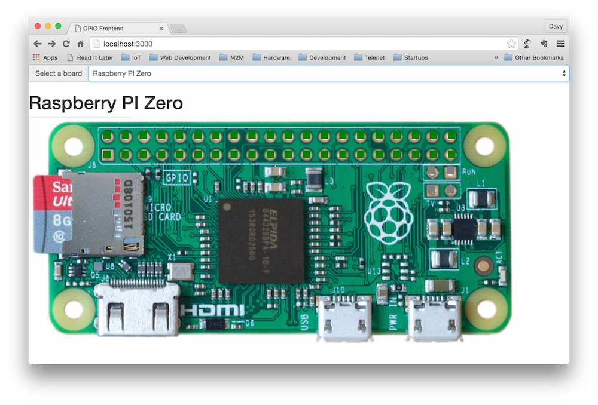
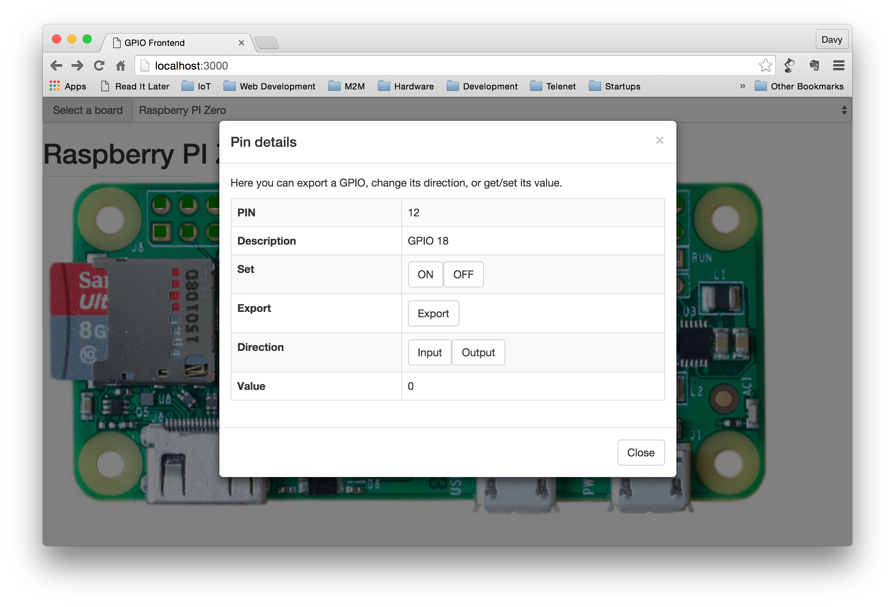
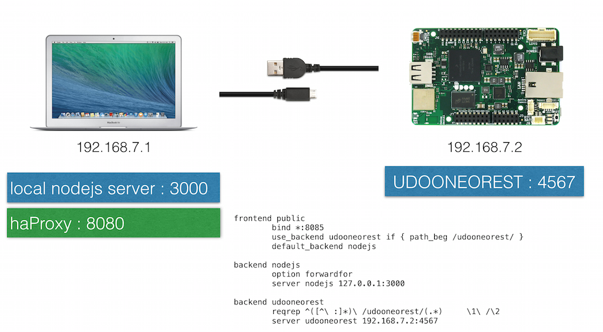

## Introduction

Sample ReactJS project acting as a frontend for my UDOO Neo / Rasperry PI.

**Work in progress**

## Installing

Install the package 
```
sudo npm install https://github.com/ddewaele/web-gpio-react#0.0.0 -g
```

Start the server

```
web-gpio-react
```

Point your browser to [http://localhost:3000/](http://localhost:3000/)

[Live app](http://ddewaele.github.io/web-gpio-react) (Github pages)

## Screenshots





## Configuration

By defining a board like this, a UI is rendered allowing you to interact with the GPIOs.

```json
{
  "name":"UDOO Neo",
  "imageUrl":"./images/neo-top-view.png",
  "headers":[
  {
      "name":"J6",      
      "xyCoords":[210,48], 
        "rows":10,        
        "cols":2,         
        "spaceX":25,      
        "spaceY":24       
    },    
    {
      "name":"J4",      
      "xyCoords":[485,48],    
      "rows":8,         
      "cols":2,         
      "spaceX":25,    
      "spaceY":24       
    },    
    {
      "name":"J7",      
      "xyCoords":[536,567],   
      "rows":6,         
      "cols":2,         
      "spaceX":25,      
      "spaceY":24       
    },  
    {
      "name":"J5",      
      "xyCoords":[304,567],   
      "rows":8,         
      "cols":2,         
      "spaceX":25,      
      "spaceY":24       
    }             
  ],
  "gpios": [
    {"location":"J6_4_1","pin":"13","gpio":"102","description":"pin 13 inner bank"},
    {"location":"J6_5_1","pin":"12","gpio":"100","description":"pin 12 inner bank"},
    {"location":"J6_6_1","pin":"11","gpio":"147","description":"pin 11 inner bank"},
    {"location":"J6_9_1","pin":"8","gpio":"105","description":"pin 8 inner bank"},
    {"location":"J4_5_1","pin":"2","gpio":"104","description":"pin 2 inner bank"},
    {"location":"J4_4_1","pin":"3","gpio":"143","description":"pin 3 inner bank"},
    {"location":"J4_3_1","pin":"4","gpio":"142","description":"pin 4 inner bank"},
    {"location":"J5_5_1","pin":"42","gpio":"127","description":"pin 42 outer bank"}
  ]

}

var boardConfigPiZero = {
  "name":"Raspberry PI Zero",
  "imageUrl":"./images/rpi_zero.jpg",
  "headers":[
  {
      "name":"J8",      
      "xyCoords":[145,26],
        "rows":20,        
        "cols":2,         
        "spaceX":35.5,    
        "spaceY":38       
    },    
    {
      "name":"J5",      
      "xyCoords":[780,95],   
      "rows":2,         
      "cols":2,         
      "spaceX":38,      
      "spaceY":38       
    }             
  ],
  "gpios": [
    {"location":"J8_0_0","pin":"13","gpio":"102","description":"5V"},
    {"location":"J8_1_0","pin":"12","gpio":"100","description":"5V"},
    {"location":"J8_2_0","pin":"11","gpio":"147","description":"GND"},
    {"location":"J8_0_1","pin":"8","gpio":"105","description":"3.3V"}]

}

```

## Server side setup




# Project setup

This project was setup by doing executing following steps :

1. Install the ReactJS dependencies via npm

```
npm install --save react react-dom babelify babel-preset-react
```

This will install some artifacts in the ```node_modules``` folder.

2. Create some web artifacts in the public folder.

These include

- public/index.html
- public/css/base.css
- public/scripts/main.js

Our index.html looks like this :

```
<!DOCTYPE html>
<html>
  <head>
    <meta charset="utf-8">
    <title>React Tutorial</title>
    <script src="https://cdnjs.cloudflare.com/ajax/libs/react/0.14.0/react.js"></script>
    <script src="https://cdnjs.cloudflare.com/ajax/libs/react/0.14.0/react-dom.js"></script>
    <script src="https://cdnjs.cloudflare.com/ajax/libs/babel-core/5.6.15/browser.js"></script>
    <script src="https://cdnjs.cloudflare.com/ajax/libs/jquery/2.1.1/jquery.min.js"></script>
    <script src="https://cdnjs.cloudflare.com/ajax/libs/marked/0.3.2/marked.min.js"></script>
  </head>
  <body>
    <div id="content"></div>
    <script type="text/babel" src="scripts/main.js"></script>
    <script type="text/babel">

      // To get started with this tutorial running your own code, simply remove
      // the script tag loading scripts/example.js and start writing code here.
    </script>
  </body>
</html>
```

3. Creare a simple NodeJS server

```
var fs = require('fs');
var path = require('path');
var express = require('express');
var bodyParser = require('body-parser');
var app = express();

app.set('port', (process.env.PORT || 3000));

app.use('/', express.static(path.join(__dirname, 'public')));
app.use(bodyParser.json());
app.use(bodyParser.urlencoded({extended: true}));

app.listen(app.get('port'), function() {
  console.log('Server started: http://localhost:' + app.get('port') + '/');
});
```

4. Provide a gitignore file

I also added a [.gitignore file](https://github.com/facebook/react/blob/master/.gitignore) to this repo.


# UDOO integration

## haProxy


wget http://ports.ubuntu.com/ubuntu-ports/pool/main/h/haproxy/haproxy_1.4.24-2ubuntu0.4_armhf.deb
sudo dpkg -i haproxy_1.4.24-2ubuntu0.4_armhf.deb 

## GPIOs

The GPIOs we'll be working with are defined in our javascript like this :

```
var gpios = [
	{"key":1, "pin":"13","gpio":"102","description":"pin 13 inner bank"},
	{"key":2, "pin":"12","gpio":"100","description":"pin 12 inner bank"},
	{"key":3, "pin":"11","gpio":"147","description":"pin 11 inner bank"},
	{"key":3, "pin":"8","gpio":"105","description":"pin 8 inner bank"},
	{"key":4, "pin":"2","gpio":"104","description":"pin 2 inner bank"},
	{"key":5, "pin":"3","gpio":"143","description":"pin 3 inner bank"},
	{"key":6, "pin":"4","gpio":"142","description":"pin 4 inner bank"},
	{"key":7, "pin":"42","gpio":"127","description":"pin 42 outer bank"}
];
```

The sample qpplication will be using a REST API running on the UDOO to interact with the GPIOs.
But before we do that, let me show you how you can interact with the GPIOs on a lower level (Linux OS)

We can manipulate them using Linux by

- Exporting them
- Setting the proper direction (in/out)
- Reading / Writing values


### Exporting GPIOs

We need to export GPIOs before we can start using them. Once exported they will become available as resources in ```/sys/class/gpio```.

```
root@udooneo:/sys/class/gpio# ls -ltr /sys/class/gpio

total 0
lrwxrwxrwx 1 root root       0 Jan  1  1970 gpiochip96 -> ../../devices/soc0/soc.0/2000000.aips-bus/20a8000.gpio/gpio/gpiochip96
lrwxrwxrwx 1 root root       0 Jan  1  1970 gpiochip64 -> ../../devices/soc0/soc.0/2000000.aips-bus/20a4000.gpio/gpio/gpiochip64
lrwxrwxrwx 1 root root       0 Jan  1  1970 gpiochip32 -> ../../devices/soc0/soc.0/2000000.aips-bus/20a0000.gpio/gpio/gpiochip32
lrwxrwxrwx 1 root root       0 Jan  1  1970 gpiochip192 -> ../../devices/soc0/soc.0/2000000.aips-bus/20b4000.gpio/gpio/gpiochip192
lrwxrwxrwx 1 root root       0 Jan  1  1970 gpiochip160 -> ../../devices/soc0/soc.0/2000000.aips-bus/20b0000.gpio/gpio/gpiochip160
lrwxrwxrwx 1 root root       0 Jan  1  1970 gpiochip128 -> ../../devices/soc0/soc.0/2000000.aips-bus/20ac000.gpio/gpio/gpiochip128
lrwxrwxrwx 1 root root       0 Jan  1  1970 gpiochip0 -> ../../devices/soc0/soc.0/2000000.aips-bus/209c000.gpio/gpio/gpiochip0
--w--w---- 1 root dialout 4096 Jan  1  1970 unexport
lrwxrwxrwx 1 root root       0 Dec 19 15:46 gpio102 -> ../../devices/soc0/soc.0/2000000.aips-bus/20a8000.gpio/gpio/gpio102
lrwxrwxrwx 1 root root       0 Dec 19 15:46 gpio127 -> ../../devices/soc0/soc.0/2000000.aips-bus/20a8000.gpio/gpio/gpio127
lrwxrwxrwx 1 root root       0 Dec 19 16:18 gpio25 -> ../../devices/soc0/soc.0/2000000.aips-bus/209c000.gpio/gpio/gpio25
--w--w---- 1 root ugpio   4096 Dec 19 20:39 export
lrwxrwxrwx 1 root root       0 Dec 19 20:39 gpio104 -> ../../devices/soc0/soc.0/2000000.aips-bus/20a8000.gpio/gpio/gpio104
```

Some sample commands :

```
# Exporting GPIOs
echo 102 > /sys/class/gpio/export
echo 127 > /sys/class/gpio/export

# Setting the diection
echo out > /sys/class/gpio/gpio102/direction
echo out > /sys/class/gpio/gpio127/direction

# Writing values
echo 0 > /sys/class/gpio/gpio102/value
echo 0 > /sys/class/gpio/gpio127/value
echo 1 > /sys/class/gpio/gpio102/value
echo 1 > /sys/class/gpio/gpio127/value

# Reading values
cat /sys/class/gpio/gpio147/value

```


## UDOONeoRest

### REST calls

Exporting a GPIO, setting the direction and setting a value.
```
curl -v -H 'Content-Length: 0' -X PUT http://localhost:8085/udooneorest/gpio/102/export
curl -v -H 'Content-Length: 0' -X POST http://localhost:8085/udooneorest/gpio/102/direction/out
curl -v -H 'Content-Length: 0' -X PUT http://localhost:8085/udooneorest/gpio/102/value/1
curl -v -H 'Content-Length: 0' -X PUT http://localhost:8085/udooneorest/gpio/102/value/0
```                                   

Performing an invalid call
```
curl -v -H 'Content-Length: 0' -X PUT http://localhost:8085/udooneorest/invalid_call
```

Error returned When the gpio hasn't been exported yet
```
{"status" : "failed", "message" : "No such file or directory @ rb_sysopen - /sys/class/gpio/gpio142/value"}
```

When the gpio direction isn't set to out
```
{"status" : "failed", "message" : "Operation not permitted error occurred. Has the gpio been set to output mode?"}
```


### lazyrest
As an alternative to the REST cals above

```
curl -v http://localhost:4567/lazyrest/gpio/25/export
curl -v http://localhost:4567/lazyrest/gpio/25/direction/out
curl -v http://localhost:4567/lazyrest/gpio/25/value/1


curl -v http://localhost:4567/lazyrest/gpio/105/export
curl -v http://localhost:4567/lazyrest/gpio/105/direction/out
curl -v http://localhost:4567/lazyrest/gpio/105/value/1


curl -v http://localhost:4567/lazyrest/gpio/104/export
curl -v http://localhost:4567/lazyrest/gpio/104/direction/out
curl -v http://localhost:4567/lazyrest/gpio/104/value/1

curl -v http://localhost:4567/lazyrest/gpio/142/export
curl -v http://localhost:4567/lazyrest/gpio/142/direction/out
curl -v http://localhost:4567/lazyrest/gpio/142/value/1

curl -v http://localhost:4567/lazyrest/gpio/143/export
curl -v http://localhost:4567/lazyrest/gpio/143/direction/out
curl -v http://localhost:4567/lazyrest/gpio/143/value/1
```


