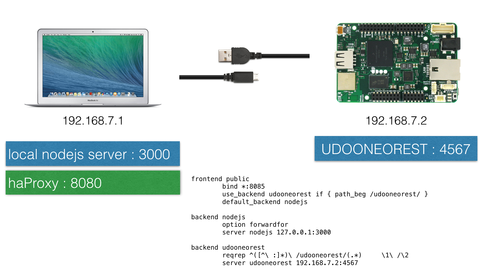

[](https://travis-ci.org/ddewaele/web-gpio-react)

## Introduction

Sample ReactJS project acting as a frontend for my UDOO Neo / Rasperry PI. 

The software consists of a frontend (ReactJS) and backend (NodeJS) enabeling you to 

- Define "boards" (any physical devices that exposes pins)
- Present them on a webpage
- Interact with the GPIOs


This is very much still a **work in progress** and far from finished. Consider it alpha stage at the moment.

We support various ways of installing / running the software:

- Installing through npm as a node package
- Installing it a a service on a linux distro
- Running it from the source using npm start
- Running it with your own webserver.

More details can be found below:

## Installing

You can install this module using the node package manager (npm) like this:
```
sudo npm install https://github.com/ddewaele/web-gpio-react#0.0.1 -g
```

In order to start the server manually simply execute the following command

```
web-gpio-react
```

Point your browser to [http://localhost:3000/](http://localhost:3000/)

In order to interact with your board, you'll need to setup haProxy. (see later section)


## Installing a a service

If you're installing this on a linux distro (as is probably the case in terms of UDOO Neo / RaspberryPi Zero), you can install the software as a linux service using forever-service. The advantages are :

- It's the standard way of doing things in Linux
- It start automatically when device is rebooted
- Auto-restart in case the service crashes.

Here are the very simple steps needed :

We will be using ```forever``` and the ```forever-service``` packages. These need to be installed globally.

```
sudo npm install -g forever
sudo npm install -g forever-service
```

Install the service

```
sudo forever-service install web-gpio-react --script /usr/local/bin/web-gpio-react 

forever-service version 0.5.4

Platform - Ubuntu 14.04.3 LTS
runuserpath not found
web-gpio-react provisioned successfully

Commands to interact with service web-gpio-react
Start   - "sudo start web-gpio-react"
Stop    - "sudo stop web-gpio-react"
Status  - "sudo status web-gpio-react"
Restart - "sudo restart web-gpio-react"
```

This will have installed the web-gpio-react service using the following configuration file : ```/etc/init/web-gpio-react.conf```.

## Running from the source

You can also clone the repo, enter the folder and run

```
npm start
```

If you don't have node installed, you can also start a simply http server using Python.

Enter the ```public``` folder and run the following command

```
python -m SimpleHTTPServer
```

This will start a webserver on port  ```8000```. Point your browser to [http://localhost:8000/](http://localhost:8000/)


## Live app

[Live app](http://ddewaele.github.io/web-gpio-react) (Github pages)


## Configuration

The tool receives the board information via a REST API. This REST API is very simple. At the moment the following calls are supported

```
curl http://localhost:3000/boards
```

It return a collection of board objects with one property, its name.

Using its name we can retrieve the details of the board.

We currently have 2 boards defined :

- [udoo-neo](./public/json/boards/udoo-neo.json)
- [raspberrypi-zero](./public/json/boards/raspberrypi-zero.json)

The details of these boards can be retrieved like this:

```
curl http://localhost:3000/boards/udoo-neo
curl http://localhost:3000/boards/raspberrypi-zero
```

These are currently stored as json files in the ```public/json``` folder.


## Server side setup

The basic idea is to make your IoT device available through some kind of VPN solution.
When the IoT device has started the ```web-gpio-react``` software, you'll be able to interface with its hardware from anywhere in the world.




### haProxy

In order to interact with the board itself, we can plugin different implementations.
We currently support the [udooneorest](https://github.com/marksull/udooneorest) library that can be installed as a ruby gem.
By default, the udooneorest library will run at [http://localhost:4567](http://localhost:4567).

Using the [provided haProxy config file](./docs/haproxy.cfg), we can expose the solution on [http://localhost:8080](http://localhost:8080).
haProxy will ensure that 

- web-gpio-react calls are redirected to [http://localhost:3000](http://localhost:3000).
- udooneorest calls are redirected to [http://localhost:4567](http://localhost:4567).

# UDOO integration

## haProxy

haProxy can be installed using the following commands.

```
wget http://ports.ubuntu.com/ubuntu-ports/pool/main/h/haproxy/haproxy_1.4.24-2ubuntu0.4_armhf.deb
sudo dpkg -i haproxy_1.4.24-2ubuntu0.4_armhf.deb 
```

Then simply drop the configuration file in ```/etc/haproxy/haproxy.cfg```

## GPIOs

The GPIOs we'll be working with are defined in our javascript like this :

```
var gpios = [
	{"key":1, "pin":"13","gpio":"102","description":"pin 13 inner bank"},
	{"key":2, "pin":"12","gpio":"100","description":"pin 12 inner bank"},
	{"key":3, "pin":"11","gpio":"147","description":"pin 11 inner bank"},
	{"key":3, "pin":"8","gpio":"105","description":"pin 8 inner bank"},
	{"key":4, "pin":"2","gpio":"104","description":"pin 2 inner bank"},
	{"key":5, "pin":"3","gpio":"143","description":"pin 3 inner bank"},
	{"key":6, "pin":"4","gpio":"142","description":"pin 4 inner bank"},
	{"key":7, "pin":"42","gpio":"127","description":"pin 42 outer bank"}
];
```

The sample qpplication will be using a REST API running on the UDOO to interact with the GPIOs.
But before we do that, let me show you how you can interact with the GPIOs on a lower level (Linux OS)

We can manipulate them using Linux by

- Exporting them
- Setting the proper direction (in/out)
- Reading / Writing values


### Exporting GPIOs

We need to export GPIOs before we can start using them. Once exported they will become available as resources in ```/sys/class/gpio```.

```
root@udooneo:/sys/class/gpio# ls -ltr /sys/class/gpio

total 0
lrwxrwxrwx 1 root root       0 Jan  1  1970 gpiochip96 -> ../../devices/soc0/soc.0/2000000.aips-bus/20a8000.gpio/gpio/gpiochip96
lrwxrwxrwx 1 root root       0 Jan  1  1970 gpiochip64 -> ../../devices/soc0/soc.0/2000000.aips-bus/20a4000.gpio/gpio/gpiochip64
lrwxrwxrwx 1 root root       0 Jan  1  1970 gpiochip32 -> ../../devices/soc0/soc.0/2000000.aips-bus/20a0000.gpio/gpio/gpiochip32
lrwxrwxrwx 1 root root       0 Jan  1  1970 gpiochip192 -> ../../devices/soc0/soc.0/2000000.aips-bus/20b4000.gpio/gpio/gpiochip192
lrwxrwxrwx 1 root root       0 Jan  1  1970 gpiochip160 -> ../../devices/soc0/soc.0/2000000.aips-bus/20b0000.gpio/gpio/gpiochip160
lrwxrwxrwx 1 root root       0 Jan  1  1970 gpiochip128 -> ../../devices/soc0/soc.0/2000000.aips-bus/20ac000.gpio/gpio/gpiochip128
lrwxrwxrwx 1 root root       0 Jan  1  1970 gpiochip0 -> ../../devices/soc0/soc.0/2000000.aips-bus/209c000.gpio/gpio/gpiochip0
--w--w---- 1 root dialout 4096 Jan  1  1970 unexport
lrwxrwxrwx 1 root root       0 Dec 19 15:46 gpio102 -> ../../devices/soc0/soc.0/2000000.aips-bus/20a8000.gpio/gpio/gpio102
lrwxrwxrwx 1 root root       0 Dec 19 15:46 gpio127 -> ../../devices/soc0/soc.0/2000000.aips-bus/20a8000.gpio/gpio/gpio127
lrwxrwxrwx 1 root root       0 Dec 19 16:18 gpio25 -> ../../devices/soc0/soc.0/2000000.aips-bus/209c000.gpio/gpio/gpio25
--w--w---- 1 root ugpio   4096 Dec 19 20:39 export
lrwxrwxrwx 1 root root       0 Dec 19 20:39 gpio104 -> ../../devices/soc0/soc.0/2000000.aips-bus/20a8000.gpio/gpio/gpio104
```

Some sample commands :

```
# Exporting GPIOs
echo 102 > /sys/class/gpio/export
echo 127 > /sys/class/gpio/export

# Setting the diection
echo out > /sys/class/gpio/gpio102/direction
echo out > /sys/class/gpio/gpio127/direction

# Writing values
echo 0 > /sys/class/gpio/gpio102/value
echo 0 > /sys/class/gpio/gpio127/value
echo 1 > /sys/class/gpio/gpio102/value
echo 1 > /sys/class/gpio/gpio127/value

# Reading values
cat /sys/class/gpio/gpio147/value

```


